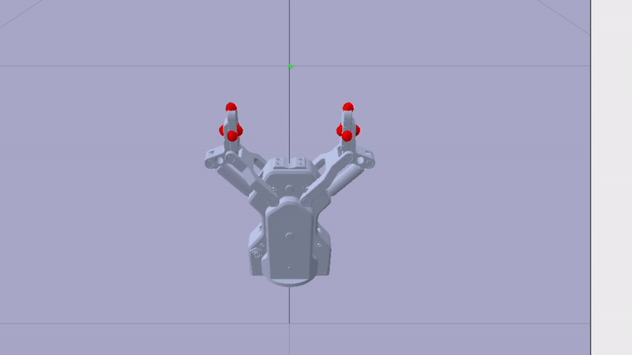
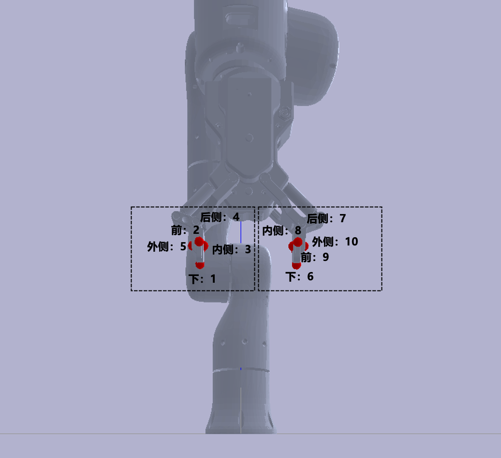
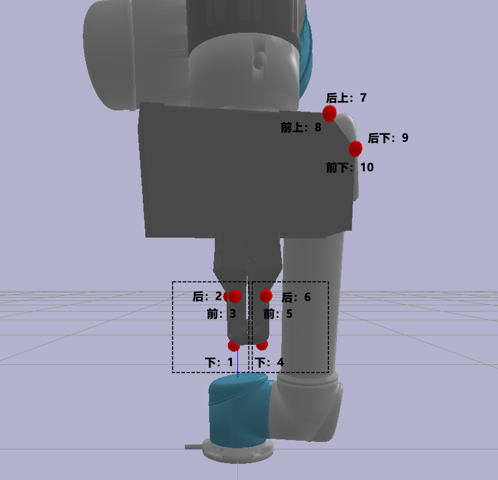
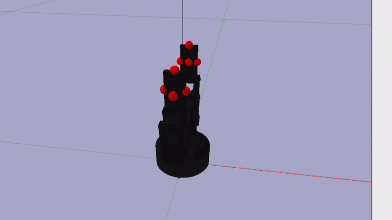
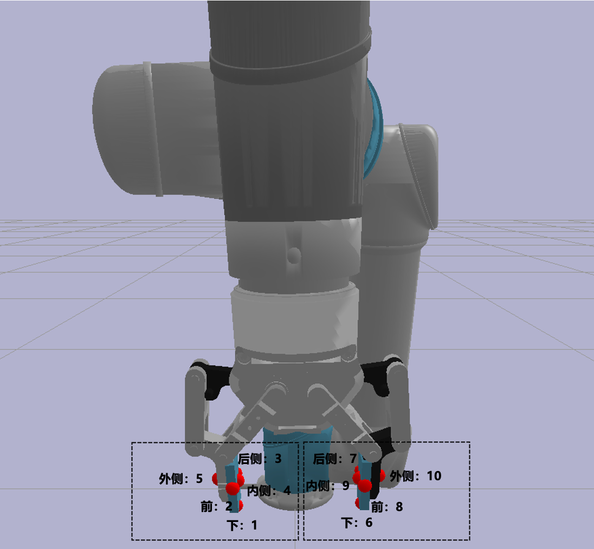
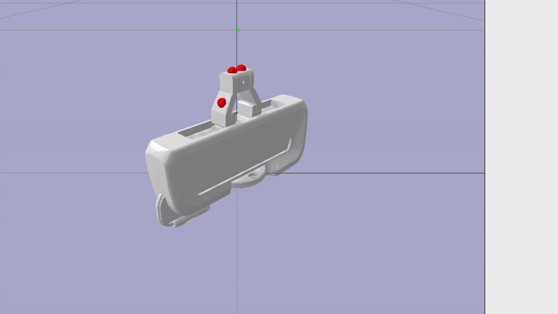
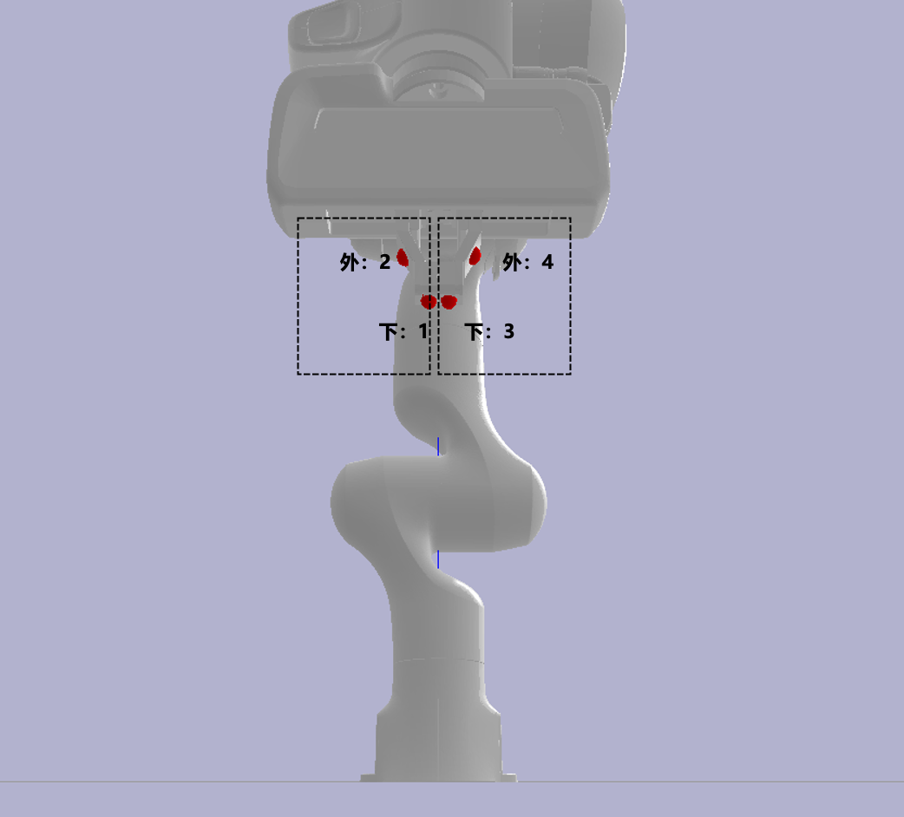
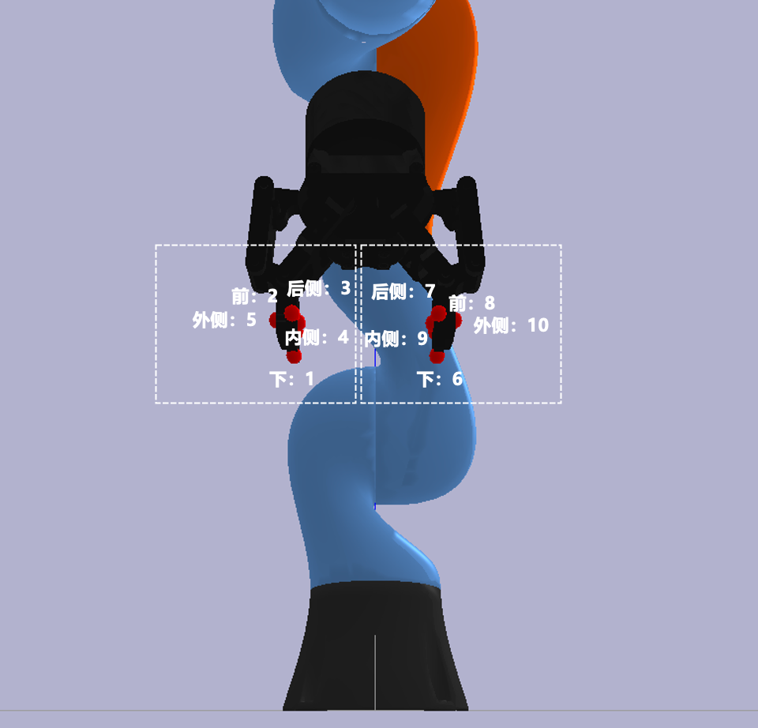

# GUI4LocalAnnotation
gui for 2d points annotation

## Installation
```bash
conda create -n tracker python=3.11
conda activate tracker
pip install PYQT5
```

## Data preparation
Download the required cfg data from: https://drive.google.com/drive/folders/1j72t0TYPMby-XYy2hrKBJX4QEgrLinfg?usp=drive_link
```
cd GUI4LocalAnnotation
mkdir anno_data
```

Place the downloaded data in the `anno_data` and the folder should be organized follow the structure below:
```
anno_data
├── cfg_0001
├── cfg_0002
│   ├── task_0026_user_0003_scene_0002_cfg_0002
│   │   ├── cfg_0002_cam_036422060215.mp4
│   │   ├── cfg_0002_cam_037522062165.mp4
│   │   ├── cfg_0002_cam_104122061850.mp4
│   │   ├── cfg_0002_cam_104122063678.mp4
│   │   ├── cfg_0002_cam_104422070044.mp4
│   │   ├── cfg_0002_cam_105422061350.mp4
│   │   └── joint_angle_info.pkl
│   ├── task_0028_user_0003_scene_0008_cfg_0002
│   ├── ...
├── cfg_0003
│   ├── ...
├── ...

```

## Usage
```bash
python gui_local.py
```

## Description of keypoints annotation for each cfg

#### cfg_0001: flexiv+ag_95
<div style="display: flex; justify-content: space-around;">
    
    
</div>
<!-- 
 -->

#### cfg_0002: flexiv+ag_95
<div style="display: flex; justify-content: space-around;">
    
    
</div>
<!-- 
 -->

#### cfg_0003: ur5+wsg_50
<div style="display: flex; justify-content: space-around;">
    
    
</div>
<!-- 
 -->

#### cfg_0004: ur5+robotiq_85
<div style="display: flex; justify-content: space-around;">
    
    
</div>
<!-- 
 -->

#### cfg_0005: franka
<div style="display: flex; justify-content: space-around;">
    
    
</div>
<!-- 
 -->

#### cfg_0006: kuka+robotiq_85
<div style="display: flex; justify-content: space-around;">
    
    
</div>
<!-- 
 -->

#### cfg_0007: kuka+robotiq_85
<div style="display: flex; justify-content: space-around;">
    
    
</div>
<!-- 
 -->